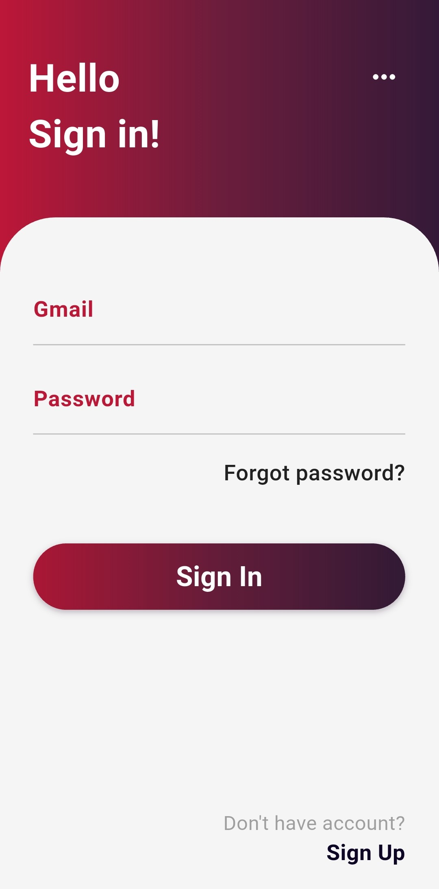
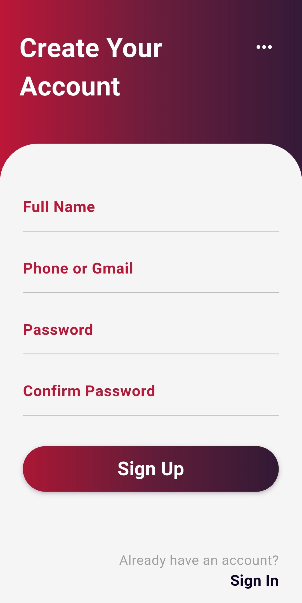

# Auth Sample

> A modern Flutter authentication sample app demonstrating BLoC, Clean Architecture, Aes Encryption ,Formz and More.

---

## 🚀 Features

* **Authentication:** Secure Sign Up & Sign In.
* **Form Validation:** Real-time form validation using `Formz`.
* **Secure Storage:** Tokens and user keys stored securely on-device.
* **Scalable Architecture:** Built with a clean, testable, and maintainable structure.

---

## 🏛️ Architecture

This project follows a **Clean Architecture** pattern, separating the app into three main layers:

* **Data:** Handles data sources (remote API, local storage) and the repository implementation.
* **Domain:** Contains the core business logic, entities, and repository contracts (use cases).
* **Presentation:** Manages the UI (Widgets) and state (BLoCs).

### Key Technologies Used

* **State Management:** `flutter_bloc`
* **Code Generation:** `freezed` for immutable states/events and `mockito` for testing.
* **Form Validation:** `formz` for robust, testable form inputs.
* **Service Location:** `get_it` for dependency injection.
* **Networking:** `dio` for network requests.
* **Security:** `flutter_secure_storage` and `encrypt` for token/data protection.
* **Testing:** `bloc_test` and `mockito` for 100% unit test coverage on business logic.

---

## 📸 Screenshots

| Splash Screen | Intro Screen |
| :---: | :---: |
|  |  |
| **Login Screen** | **Register Screen** |
|  |  |

---

## 🏁 Getting Started

Follow these instructions to get a copy of the project up and running on your local machine.

### Prerequisites

You will need the Flutter SDK installed on your machine.
* [Flutter SDK Installation Guide](https://flutter.dev/docs/get-started/install)

### Installation & Setup

1.  **Clone the repository:**
    ```sh
    git clone [https://github.com/ali-52-max/auth_sample.git]
    cd [your-project-folder]
    ```

2.  **Install dependencies:**
    ```sh
    flutter pub get
    ```

3.  **Configure Environment:**

    * **Create `.env` File:** This project uses a `.env` file for the general-purpose AES encryption key. This file is ignored by Git, so you must create your own.
      Create a file named `.env` at the **root of the project** and add your key:

        ```env
        # Example .env file
        REGISTRATION_KEY=your_32_byte_base64_encryption_key_here
        ```

    * **Set Base URL:** The API `baseUrl` is hardcoded in the `DioFactory`.
      Open `lib/core/network/dio_factory.dart` and change the `baseUrl` variable to point to your API.

4.  **Run code generation:**
    This project uses `build_runner` to generate files for `freezed`, `mockito`, and your DI setup. You must run this command before running the app or tests.
    ```sh
    flutter pub run build_runner build --delete-conflicting-outputs
    ```

---

## K Running the Application

Once the setup is complete, you can run the app on your connected device or emulator:

```sh
flutter run